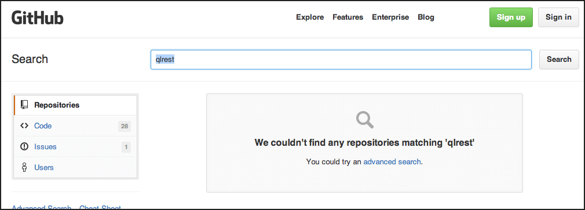
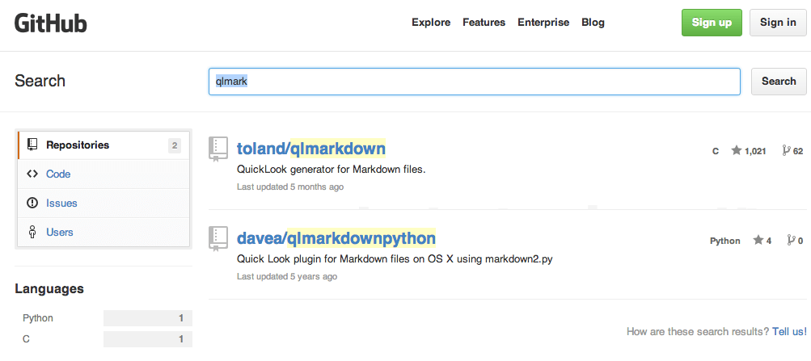

==========================
QuickLook reST with Nimrod
==========================

`Quick Look <https://en.wikipedia.org/wiki/QuickLook>`_ is a quick preview
feature developed by Apple. `ReST, or reStructuredText
<http://docutils.sourceforge.net>`_ is a text processing system for
transforming plaintext documentation into other formats. `Nimrod is a
programming language <http://nimrod-code.org>`_. And now that I've introduced
everybody, this project is a fusion of all of them to provide a reST QuickLook
viewer implemented in Nimrod.

There are alternative python implementations like
`https://github.com/cluther/qlrest <https://github.com/cluther/qlrest>`_, which
somehow started from the `markdown QuickLook plugin
<https://github.com/toland/qlmarkdown>`_. However I dislike the python
versions for two reasons:

1. Python installations are very brittle, any change in python or its packages
   can make rendering stop. The last three MacOSX updates broke my python
   programs and required fetching newer versions from the internet. That's not
   a very good way to treat users. Instead, this plugin is statically compiled,
   no changes on your system should break it.
2. .. image:: docs/python_stahp_300.jpg
      :align: right

   Performance. Processing this very readme file with python on my machine
   takes 0.5 seconds, but 0.02 seconds with nimrod (as measured from the
   command line in a non reproducible test). Do believe me, python is slow,
   maybe you should `stop using it <http://knowyourmeme.com/memes/stahp>`_ and
   pick a better language.  By the way, the animal on the right is Nimrod's
   mascot, a `badass honey badger
   <http://www.youtube.com/watch?v=4r7wHMg5Yjg>`_. Nimrod doesn't care about
   your Python being slow and eats it fearlessly.

The MarkDown Conspiracy
=======================

Have you noticed that markdown seems present just about everywhere? On the
other hand, rst not so much. Why, I wonder? Let's check github for the existing
`qlrest plugins <https://github.com/cluther/qlrest>`_. So I go to
`https://github.com <https://github.com>`_ and type in the search box
**qlrest**:

Huh? Weird. How come there is no match for other qlrest repositories? Maybe a
search for **qlmark** won't work?

Ah, that's interesting. So markdown is found, but rest not. Well, that's
clearly it, Mulder told me it's a conspiracy against the rst format. Other
arguments like the rst implementation being python rather than C, or the spec
sucking, pale in comparison with Big Brother not allowing you even to *think*
in rst.

Madness.

Digression: you can view gihub on mobile devices but the *desktop* version
can't resize below 1000px width. That's another conspiracy there waiting to be
uncovered… the conspiracy of web designers who suck…

License
=======

`MIT license <LICENSE.rst>`_.

Installation
============

From source code
----------------

Check out the repository and open the project file with Xcode. The project has
been tested on MacOSX 10.8 and Xcode 5.0.2. You don't need anything else, since
the project includes the pre generated C files by Nimrod. Simply select the
QuickLook target and build it. Once built, right click on the
``Product->QuickLook reStructuredText.qlgenerator`` and select ``Show in
Finder``. Now you can move that plugin somewhere useful, like
``~/Library/QuickLook`` and run ``qlmanage -r`` to reset Quick Look or
logout/reboot/whatever.

Now you can press space on ``rst`` or ``rest`` files from the Finder and if
everything goes well you should see an HTML preview. Note that this version of
the software is incomplete, and some files might not render for example due to
missing directives. Please report them with the `issue tracker
<https://github.com/gradha/quicklook-rest-with-nimrod/issues>`_.

Binary installation
-------------------

If you trust binaries and random strangers on the internet, you can go to
`https://github.com/gradha/quicklook-rest-with-nimrod/releases
<https://github.com/gradha/quicklook-rest-with-nimrod/releases>`_ and download
any of the ``.zip`` files attached to a specific release. They contain just the
plugin which you can move to ``~/Library/QuickLook``. After that, run
``qlmanage -r`` to reset Quick Look or logout/reboot/whatever and you should be
able to see ``.rst`` and ``.nim`` files as rendered HTML.

The plugin should work on all MacOSX versions since Snow Leopard (10.6), though
on Snow Leopard it seems to have threading issues where the first attempt to
display the file will show a processing spinner forever and won't show the
actual rendered version until you close the QuickLook window and open it again.
The plugin is forced to run on the main thread, so I don't know what's wrong.
If you know, please tell me!

Changes
=======

This is development version 0.4.1. For a list of changes see the
`docs/CHANGES.rst file <docs/CHANGES.rst>`_. The software is not complete,
expect bugs and `report them
<https://github.com/gradha/quicklook-rest-with-nimrod/issues>`_.

Plans for the future
====================

* Support for all `reST directives
  <http://docutils.sourceforge.net/docs/ref/rst/directives.html>`_. Also known
  as "yeah it doesn't adhere to the spec fully but that's because the spec
  sucks".
* More automatic install from within Xcode.
* Binary install through DMG files.
* Customizable CSS for previewed HTML.

Git branches
============

This project uses the `git-flow branching model
<https://github.com/nvie/gitflow>`_ with reversed defaults. Stable releases are
tracked in the ``stable`` branch. Development happens in the default ``master``
branch.

Feedback
========

You can send me feedback through `github's issue tracker
<https://github.com/gradha/quicklook-rest-with-nimrod/issues>`_. I also take a
look from time to time to `Nimrod's forums <http://forum.nimrod-code.org>`_
where you can talk to other nimrod programmers.
